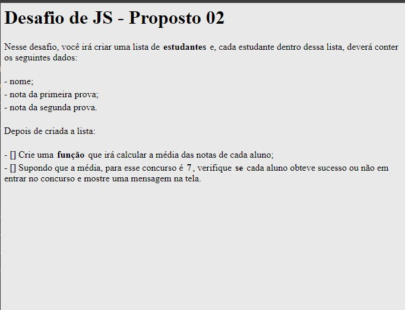

<h1 align="center"> Explorer - Desafio de JS - Proposto 02</h1>

Projeto para a formação Fullstack da Rocketseat para ensino de tecnologias WEB.  
<a href="https://www.rocketseat.com.br/formacao/fullstack?utm_source=github&utm_medium=explorer-desafio-02-js&utm_campaign=capture-explorer&utm_term=organic&utm_content=descricao-github-rogeriolins">Faça essa formação em vídeo clicando aqui.</a>

  <a href="#-tecnologias">Tecnologias</a>&nbsp;&nbsp;&nbsp;|&nbsp;&nbsp;&nbsp;
  <a href="#-projeto">Projeto</a>&nbsp;&nbsp;&nbsp;|&nbsp;&nbsp;&nbsp;
  <a href="#-layout">Layout</a>&nbsp;&nbsp;&nbsp;|&nbsp;&nbsp;&nbsp;
  <a href="#memo-licença">Licença</a>

  

 

  

## 🚀 Tecnologias

Esse projeto foi desenvolvido com as seguintes tecnologias:

- HTML e CSS
- Git e Github
- JavaScript

## 💻 Projeto

O Desafio de JS - Proposto 02 - tem as seguintes finalidades:

Criar uma lista de estudantes e, cada estudante dentro dessa lista, deverá conter os seguintes dados:

- nome;
- nota da primeira prova;
- nota da segunda prova.

Depois de criada a lista:

- [] Crie uma função que irá calcular a média das notas de cada aluno;
- [] Supondo que a média, para esse concurso é 7, verifique se cada aluno obteve sucesso ou não em entrar no concurso e mostre uma mensagem na tela.

- [Acesse o projeto finalizado, online](https://rogeriolins.github.io/explorer-desafio-js-proposto-02)

- [Assistir aulas](https://www.rocketseat.com.br/formacao/fullstack?utm_source=github&utm_medium=explorer-desafio-02-js&utm_campaign=capture-explorer&utm_term=organic&utm_content=descricao-github-rogeriolins)

## 🔖 Layout

Você pode visualizar o layout do projeto ao se matricular na formação.

## :memo: Licença

Esse projeto está sob a licença MIT.

---

Feito com ♥ by Rocketseat e codado por [Rogerio Lins](https://instagram.com/rogeriolins.dev) :wave: [Participe da nossa comunidade!](https://discord.gg/rocketseat)
